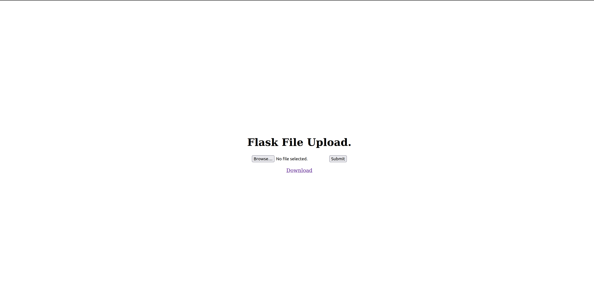

# Flask File Upload and Download Website
## Description
Very basic starting point for Flask websites that involve unauthenticated users to upload and then download files.
Usually, the files are processed inbetween uploading and downloading.

## Screenshot

## Setup
	git clone git@github.com:bauerem/flask-upload-download.git
	cd flask-upload-download
	pip install -r requirements.txt
	flask run
